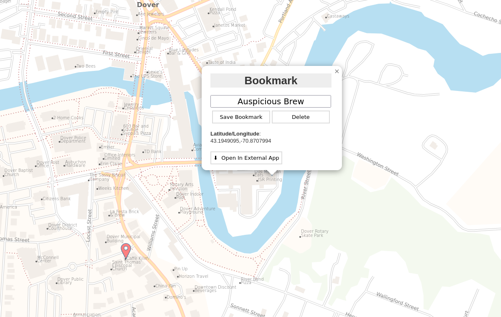

Share-A-Map is a general purpose, fully self-hosted map app for [Sandstorm](https://sandstorm.io), based on OpenStreetMap. The goal is to provide the basic functionality of Google Maps while respecting privacy.



Share-A-Map allows you to plan trip destinations with friends, store important locations, etc, and have access to the result on a convenient phone application like OrganicMaps. Use with a phone application currently requires manual export/import of a bookmarks file, but perhaps some day (with some work on the phone app side) there could be a sync option. If there are other bits of standard functionality you would like to see, please let me know!

Some self-hosted map apps will still get tile data from external sources on-demand, leaking some amount of your usage patterns to the outside world, and making you dependent on their services. With this app, all of the map data would be fully self-hosted in your Sandstorm grain, in the same way that OrganicMaps fully holds regions of the map. The map data needs to come from somewhere of course, so you need to download it, but you only need to download it once per grain. Perhaps some day the data could be shared between grains on the same server, reducing the amount of downloads further, increasing privacy. But that's very much a stretch goal.

This is simpler than other fully self-hosted OSM solutions, because the tech stack is much simpler. The full OSM stack generally includes something like postgres for generating tiles and elasticsearch for search. Neither postgres or elasticsearch play nicely with Sandstorm, and in any case startup would probably be slow. Share-A-Map uses [protomaps](https://protomaps.com) for tiles, and (as of now) sqlite3 with fts5 for search. This likely makes search less sophisticated but hopefully the tradeoff works well for this use case.

This is a work in progress. As of this writing, only a couple areas are supported. Search is basic but functional. UI could use some tweaks. But it basically works. Try it out! Let me know what you think. Chime in on the Sandstorm groups, my email address, or file an issue. The more feedback I get (positive or negative) the more I know it's worth spending time on this.

This app is currently an "experimental" app [in the Sandstorm App Market](https://apps.sandstorm.io/app/m3ctajcm6nnpce287r0a4t52ackzv7p7mmffrw88nge64fp0m8yh?experimental=true). You can try it as a demo from here, or install it on your Sandstorm instance.

# Building

`spk` only for now. **WARNING** this should be built on an environment you do not mind modifying and risking breaking, etc. This will require installing things on your system and maybe changing things. The main author uses QubesOS and thus has a dedicated VM for this project.

`build.sh` is a TODO. We can probably get this going on `vagrant-spk`. It would also be useful for auto-installing things in this section.

Git submodules, protomaps.js/setup.sh. All of the symlinks within `assets/` should be pointing to something real. build powerbox-http-proxy.

Debian (probably among other things, TODO make this comprehensive and probably put in `build.sh`): `nginx`, `python3-flask`, `python3-unidecode`, `npm`

And then for nginx:

```
sudo service nginx stop
sudo systemctl disable nginx
```

Unless you actually want to have an nginx server always running on your system.

Also install golang for the powerbox-http-proxy.

Yeah this is a TODO, feel free to fill this in with useful info.

# Running

## Normal

`spk dev`

## Without Sandstorm

Sometimes useful. I should add some instructions. But it's currently shaky, so not worth documenting since it'll probably change.

But it involves running `./demo.py`. This will start a web server on port 3857 and possibly open a browser.

# Making the data

VERY rough instructions. This will probably not be enough, but it's a starting point so ppl can see where the various parts are.

* Get a region geojson; you can see them in the `regions/` directory or you can make your own (one easy option is on protomaps.com as part of the next step)
* Go to protomaps.com and use the region geojson to export a pmtiles file for the region, or define a new region and extract it. This is the _tiles that are displayed_.
* Use the region to get the search data with the stuff in `geocoding/gazetteer/`. This lets you _search for stuff_.
* Use the search data output and the pmtiles file and go to `package-data/` to make the final downloadable files.

# License/Credit

## GeoJSON

### Base map (the "wireframe" look)

* US States https://datahub.io/core/geo-admin1-us
* World https://datahub.io/core/geo-countries

### Downloadable region polygons

As of this writing I've defined the region polygons manually on the protomaps extraction website.

# Map Data

OpenStreetMap® is open data, licensed under the Open Data Commons Open Database License (ODbL) by the OpenStreetMap Foundation (OSMF).

## Search Data (derived from Map Data)

As of this writing, I get large regions (US states, etc) data from https://download.geofabrik.de (who derives it from OpenStreetMap) and extract smaller regions for search.

I'm not sure if this is a requirement for attribution but I do not mind shouting them out!

## Tiles (derived from Map Data)

[Protomaps](https://protomaps.com) (who derives it from OpenStreetMap).

# Images

## OSM logo

https://commons.wikimedia.org/wiki/File:Openstreetmap_logo.svg

## search-marker.svg bookmark-marker.svg

Possibly edited, original from https://github.com/Leaflet/Leaflet/blob/main/src/images/marker.svg

# Software Licenses

These things aren't vendored in this repo, but they will be bundled in the resulting app, so I am noting the licenses here.

* [Leaflet](https://github.com/Leaflet/Leaflet) - BSD 2-Clause
* [Leaflet Search](https://github.com/stefanocudini/leaflet-search) - MIT
* Protomaps JS (with modifications) - BSD 3-Clause
* Protomaps demo.py - Not sure! It's not on github, I got it from their website when I first extracted data. But I changed it a lot, and plan to rewrite it in Go.
* Powerbox Proxy (for Sandstorm) - Apache 2
